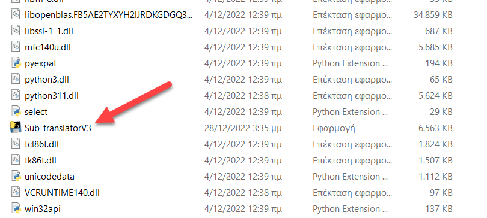
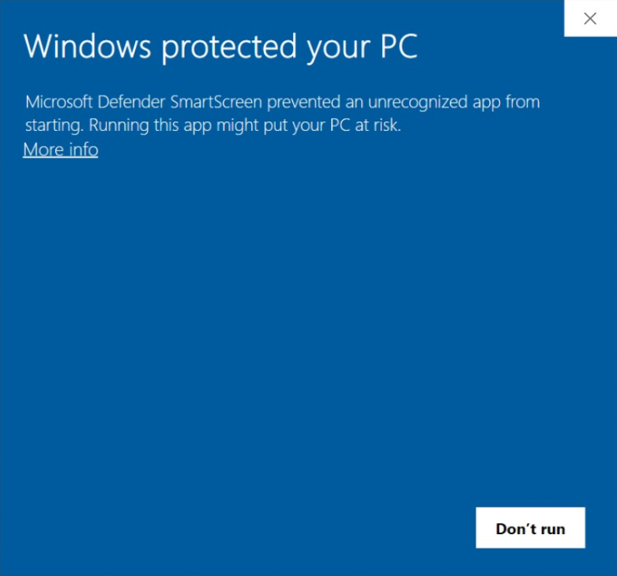

(really old and abandonned for now project, still here mostly for emotional reasons :P)

# Simple subtitle translator

A simple subtitle translator using python, tesseract and Google translate! 

A little janky rn, will rewrite in rust when i feel like it. 

Update: Working on a TTS for another project right now, the rust version may be ready this autumn if everything goes smoothly.

Update 2: Well things got in the way and now this project is in the  freezer once again. I still want to make a better version. 

Update 3: Happened to take a look at the code again and it's pretty bad so it's getting a rewrite for sure, i already have parts of the image pre-processing algorithm in the works as to improve both speed and quality. 

I have noticed a small error if one tries to change the output language for translating, tesseract may complain that it doesn't have the data files for that language. You can easily find them by googling the error though and place them in the appropriate folder. 

I'm thinking that once i refactor this i may also add some mode that takes a video file instead of the screen and generates a file with the subtitles for the whole video. That might deserve its own repo but for now exams have my attention so stay tuned if interested, it might take a few months. 

## Installation

### if you are on windows 10 you have 2 options:

*Using the PyInstaller standalone:*

1. Download the Sub_translatorV3.zip file and unzip it. 

2. Open the folder and find the Sub_translatorV3 executable.  
      
3. Click on it and it should start. (Note: when you open it for the first time you might get a security warning since windows doesn't know the contents of the executable)   
 
      

In that case simply click "more info", then click "run anyway".

*Using the source code:*
1. Download the source code file, Sub_translatorV3.py. Then download the Tesseract-OCR.zip file and unzip it.
2. Put them on the on the same directory.
3. (Make sure you have python and all modules imported installed on your machine.)  
4. Ready to go. 

### if you aren't using windows 10: 

*Using the source code:*
1. Download the source code file, Sub_translatorV3.py. Then download the Tesseract-OCR.zip file and unzip it.
2. Put them on the on the same directory.
3. (Make sure you have python and all modules imported installed on your machine.)  
4. Ready to go. 

(Note that this software has been tested for windows 10. If you find an issue when using another platform let me know.)

## How to use

When opening the programm it will print the following information on how to effectively use it. If you have any other questions or requests feel free to ask me.  

 *Subtitle traslator V3  
 A simple tool built for translating subtitles in real time  
 Made by kkounal (https://github.com/kkounal)*  
 
*--------------------------------------*

*Overview of basic function:*

 *The translator consists of two windows.  
 One of the windows is used to mark the part of the screen one wishes to translate and is trasparent.*

 *The other is used at first as a menu.  
 But after the button "Ready" has been pressed it acts as a container to display the translated text.*
 
*--------------------------------------*

 *Overview of how to effectively use the control buttons:*

 *Ready: Press to start tanslating.*

 *Test: Used to test proper function of programm.  
 Once pressed it will show importart steps in the image preproccesing and text recognision proccess.  
 They can be used to troubleshot problems. Prints identified subtitles in the console.*

 *Select custom target color: Color detection is used to seperate subtitle text from the background.  
 Usually subtitles are white so the default is also white.  
 If yours aren't you can press this button and play around with the sliders.  
 Aim for clear text on a black background with as little noise as possible for best results.  
 Then simply close the window or press esc. Combine with Test button to troubleshoot.*

 *Select custom display color: Opens a color picker dialog window where the user can choose the color   
 of the translated text. Default is a nice yellow, (#fcbe11).* 

 *Place windows: Just a shortcut for placing the windows. Made with fullscreen in mind.*
 
 *Change languages: Pressing will open a window with three textboxes for input and three buttons to confirm.    
 The first is for the target language for tesseract, the Optical Character Recognisition software this app built on.    
 The second and third are for google translate. Find supported languages here:  
 https://tesseract-ocr.github.io/tessdoc/Data-Files-in-different-versions.html  
 https://cloud.google.com/translate/docs/languages*

 *Save settings: Pressing will save all current settings to be used again when open the app.  
 These include the subtitle display color, target subtitle color and all language settings.*

 *Restore default: Restores default settings.*
 
 ## License
 
 I have chosen the unlincense so anyone who finds this useful may benefit from it. If you are unfamiliar with it it's this:
 
 "This is free and unencumbered software released into the public domain.

Anyone is free to copy, modify, publish, use, compile, sell, or
distribute this software, either in source code form or as a compiled
binary, for any purpose, commercial or non-commercial, and by any
means.

In jurisdictions that recognize copyright laws, the author or authors
of this software dedicate any and all copyright interest in the
software to the public domain. We make this dedication for the benefit
of the public at large and to the detriment of our heirs and
successors. We intend this dedication to be an overt act of
relinquishment in perpetuity of all present and future rights to this
software under copyright law.

THE SOFTWARE IS PROVIDED "AS IS", WITHOUT WARRANTY OF ANY KIND,
EXPRESS OR IMPLIED, INCLUDING BUT NOT LIMITED TO THE WARRANTIES OF
MERCHANTABILITY, FITNESS FOR A PARTICULAR PURPOSE AND NONINFRINGEMENT.
IN NO EVENT SHALL THE AUTHORS BE LIABLE FOR ANY CLAIM, DAMAGES OR
OTHER LIABILITY, WHETHER IN AN ACTION OF CONTRACT, TORT OR OTHERWISE,
ARISING FROM, OUT OF OR IN CONNECTION WITH THE SOFTWARE OR THE USE OR
OTHER DEALINGS IN THE SOFTWARE.

For more information, please refer to <https://unlicense.org>"

 
(<a href="#readme-top">back to top</a>)

